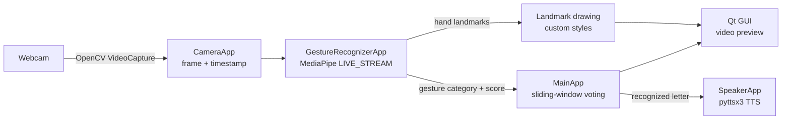

# AI Sign Language Translator

> Real-time recognition and translation of the American Sign Language (ASL) fingerspelling alphabet using artificial intelligence.

🇵🇱 **Polska wersja:** [README.pl.md](README.pl.md)
📚 **Technical documentation:** [docs/TECHNICAL_DOCUMENTATION.md](docs/TECHNICAL_DOCUMENTATION.md) · [wersja polska](docs/TECHNICAL_DOCUMENTATION.pl.md)


---

## About the project

**AI Sign Language Translator** is a desktop application that captures live video from a webcam, detects a hand in the frame, classifies the static ASL fingerspelling sign being shown, and translates it into **text** and **synthesized speech** — all in real time.

The system was developed as part of an engineering thesis
*"System rozpoznawania oraz tłumaczenia alfabetu migowego z wykorzystaniem sztucznej inteligencji"*
(*"A system for recognition and translation of the sign language alphabet using artificial intelligence"*).

The recognition pipeline is built on **MediaPipe Gesture Recognizer** with a **custom classification model** trained on the ASL alphabet dataset, while the GUI uses **Qt for Python (PySide6)** with a dark theme.


## Key features

- 🖐️ **Real-time hand detection and tracking** — MediaPipe hand landmarker running in asynchronous `LIVE_STREAM` mode.
- 🔤 **ASL fingerspelling recognition** — a custom-trained classifier recognizing 24 static ASL alphabet letters (A–Y, excluding dynamic J and Z) plus a `none` class.
- 🗣️ **Text-to-speech output** — recognized letters can be spoken aloud through the system TTS engine (`pyttsx3`), with configurable rate and volume.
- 📊 **Result smoothing** — an optional sliding-window vote over the last *N* results stabilizes the output sign and reports its average confidence score.
- 🎥 **Flexible camera configuration** — selection of the capture device, capture backend (DirectShow, Media Foundation, V4L2, GStreamer, …), resolution, and access to native driver settings.
- ⚙️ **Tunable recognition parameters** — detection / presence / tracking confidence and classification score threshold adjustable from the GUI.
- 🧩 **Interchangeable models** — any MediaPipe `.task` gesture recognizer bundle can be loaded at runtime via a file dialog; three pre-trained models ship with the repository.
- 🌒 **Modern dark UI** — PySide6 + QDarkStyle, with live FPS, handedness and confidence indicators.

## How it works



1. **Capture** — `CameraApp` grabs BGR frames from the selected camera and converts them to RGB with a nanosecond timestamp.
2. **Recognition** — `GestureRecognizerApp` feeds each frame to the MediaPipe Gesture Recognizer asynchronously; the result callback re-triggers capture of the next frame, forming a self-sustaining processing loop.
3. **Post-processing** — `MainApp` optionally aggregates the last *N* classifications, picking the most frequent sign and its average score.
4. **Output** — the annotated frame, recognized letter, confidence and FPS are rendered in the GUI; the letter is optionally synthesized to speech.

A detailed description of the architecture, threading model and training pipeline is available in the [technical documentation](docs/TECHNICAL_DOCUMENTATION.md).

## Project structure

```
AI_sign_language_translator/
├── src/                        # Application source code
│   ├── main.py                 # Entry point
│   ├── main_app.py             # Main window logic (controller)
│   ├── recognizer.py           # MediaPipe gesture recognition engine
│   ├── camera.py               # OpenCV camera wrapper
│   ├── speaker.py              # Text-to-speech engine (pyttsx3)
│   ├── custom_landmarks.py     # Custom hand-landmark drawing styles
│   ├── gui.py                  # UI class compiled from gui.ui (pyside6-uic)
│   ├── gui.ui                  # Qt Designer UI definition
│   ├── assets/                 # Icons and logos
│   ├── requirements.txt        # Python dependencies
│   └── setup.sh                # Dependency installation helper
├── models/                     # Pre-trained MediaPipe .task models
│   ├── gesture_recognizer_asl_0.task     # Default model
│   ├── gesture_recognizer_asl_1.task
│   └── gesture_recognizer_asl_mp.task
├── notebooks/                  # Model training (Google Colab)
│   ├── Custom_gesture_recognizer.ipynb
│   └── custom_gesture_recognizer.py
├── docs/                       # Documentation, thesis files, screenshots
├── run_venv.bat                # Windows launcher (cmd)
├── run_venv.ps1                # Windows launcher (PowerShell)
├── LICENSE                     # MIT license
└── README.md
```

## Requirements

| Component | Requirement |
|---|---|
| Python | 3.9 – 3.12 (64-bit), as supported by MediaPipe |
| OS | Windows 10/11 (primary target) or Linux |
| Hardware | Webcam; a modern multi-core CPU is sufficient (no GPU required) |
| Key packages | `mediapipe ≥ 0.10.14`, `PySide6 ≥ 6.7.3`, `qdarkstyle ≥ 3.2.3`, `pyttsx3 ≥ 2.98` |

> OpenCV and NumPy are installed automatically as MediaPipe dependencies.

## Installation

```bash
# 1. Clone the repository
git clone https://github.com/Kamilr616/AI_sign_language_translator.git
cd AI_sign_language_translator

# 2. Create and activate a virtual environment
python -m venv venv
# Windows (PowerShell):
.\venv\Scripts\Activate.ps1
# Windows (cmd):
venv\Scripts\activate.bat
# Linux / macOS:
source venv/bin/activate

# 3. Install dependencies
python -m pip install --upgrade pip
python -m pip install -r src/requirements.txt
```

## Running the application

The application must be started from the `src/` directory (the default model is resolved relative to it):

```bash
cd src
python main.py
```

On Windows, with the virtual environment created in `venv/` as above, you can simply use the provided launchers from the repository root:

```powershell
.\run_venv.ps1     # PowerShell
```

```bat
run_venv.bat       :: cmd
```

## Usage

1. Position your hand in front of the camera so it is fully visible in the preview.
2. Show a static ASL alphabet sign — the recognized letter, its confidence and the detected handedness are displayed live.
3. **Speak** — enable the checkbox to have every recognized letter spoken aloud.
4. **Average sign** — enable smoothing over the last *N* results (window size set with the slider) for a more stable output.
5. Adjust recognition thresholds, camera resolution, capture backend or TTS rate/volume in the settings panels, then press the corresponding **Reset** button to apply.
6. **Model** — load a different `.task` model from the `models/` directory at any time.

The reference chart of ASL alphabet signs is available in [`docs/images`](docs/images/asl-sign-language-alphabet-vectors.webp).

## Model training

The classification model was trained with **MediaPipe Model Maker** in Google Colab — the complete, reproducible pipeline is in [`notebooks/Custom_gesture_recognizer.ipynb`](notebooks/Custom_gesture_recognizer.ipynb):

- **Dataset:** [ASL Alphabet (Kaggle, grassknoted/asl-alphabet)](https://www.kaggle.com/datasets/grassknoted/asl-alphabet) — ~87,000 images, 200×200 px.
- **Preprocessing:** removal of the dynamic letters *J* and *Z* and of the *del*/*space* classes; the *nothing* class is renamed to `none` (required by Model Maker).
- **Architecture:** MediaPipe hand-landmark embedder + custom fully-connected classification head (`128 → 64 → 32`).
- **Hyperparameters:** 70 epochs, batch size 16, learning rate 0.001 with 0.95 decay, dropout 0.075, focal-loss γ = 2.
- **Export:** TensorFlow Lite bundle (`.task`) consumable directly by the application.

Details, including the dataset split and evaluation procedure, are described in the [technical documentation](docs/TECHNICAL_DOCUMENTATION.md#5-model-training-pipeline).

## Documentation

| Document | Description |
|---|---|
| [Technical documentation (EN)](docs/TECHNICAL_DOCUMENTATION.md) | Architecture, modules, data flow, training pipeline |
| [Dokumentacja techniczna (PL)](docs/TECHNICAL_DOCUMENTATION.pl.md) | Polish version of the technical documentation |
| [Engineering thesis (PL)](docs/System%20rozpoznawania%20oraz%20t%C5%82umaczenia%20alfabetu%20migowego%20z%20wykorzystaniem%20sztucznej%20inteligencji.pdf) | Full thesis text (Polish) |

## License

This project is released under the **MIT License** — see [LICENSE](LICENSE).

## Author

**Kamil Rataj** — engineering thesis project.
